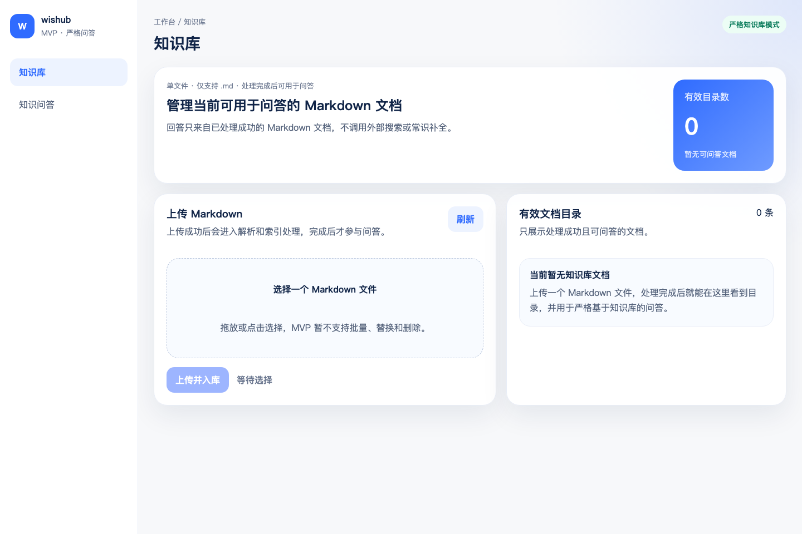
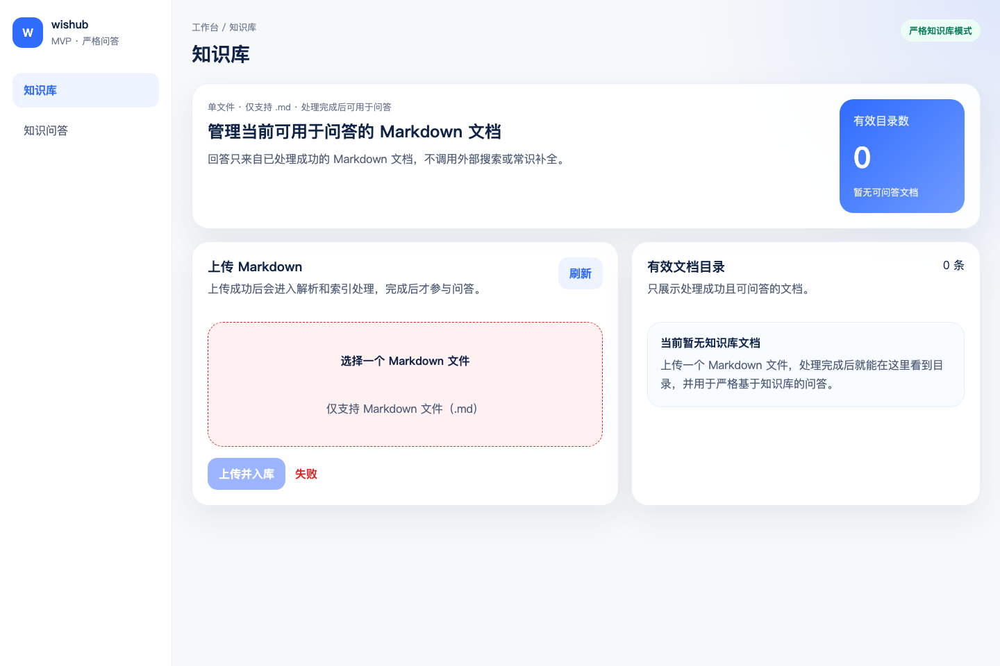
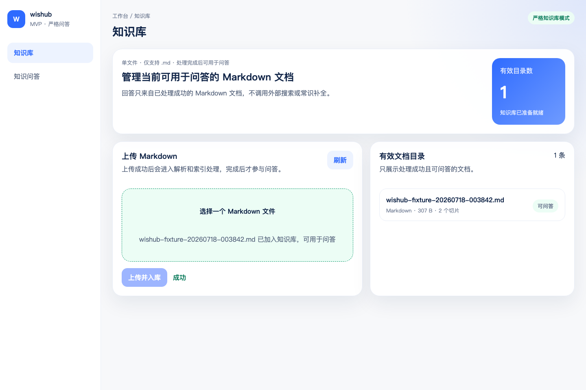
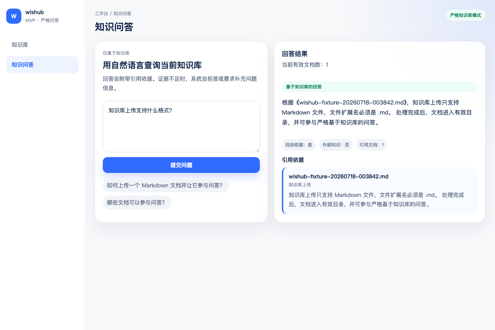
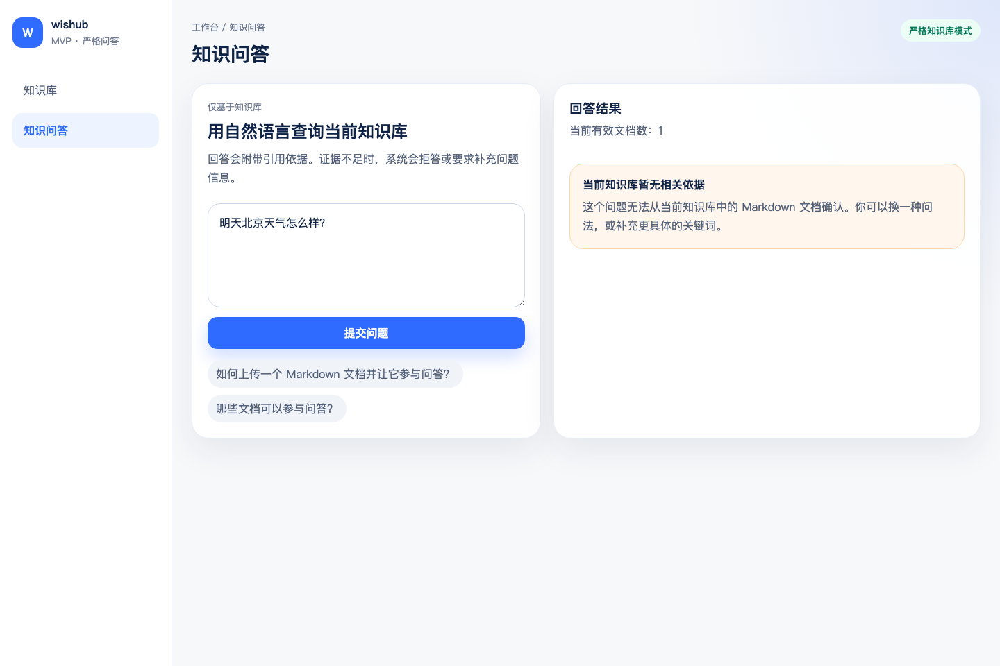
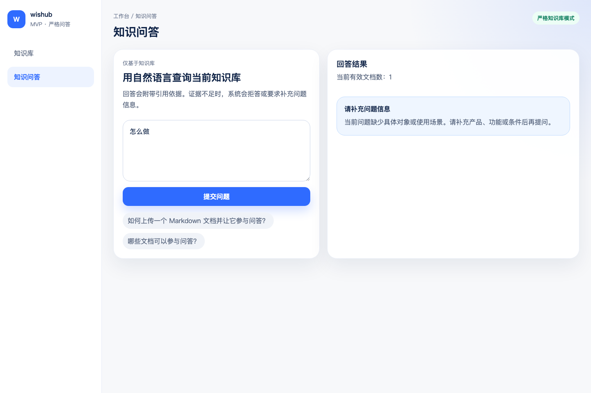

# wishub MVP E2E 测试报告

- 测试时间：2026/7/18 00:38:49
- 测试工具：Playwright Chromium
- 前端地址：http://127.0.0.1:5173
- 后端地址：http://127.0.0.1:8000
- 后端数据：临时 SQLite + 临时 Chroma + 临时上传目录
- 总用例数：6
- 通过：6
- 失败：0
- 用例总耗时：1.52 s

## 用例明细

| 用例 ID | 用例名称 | 结果 | 耗时 | 截图 |
|---|---|---:|---:|---|
| E2E-001 | 知识库空态加载 | PASS | 34 ms | [截图](./screenshots/20260718-003842-E2E-001.png) |
| E2E-002 | 非 Markdown 文件本地拦截 | PASS | 10 ms | [截图](./screenshots/20260718-003842-E2E-002.png) |
| E2E-003 | Markdown 上传并刷新有效目录 | PASS | 1.35 s | [截图](./screenshots/20260718-003842-E2E-003.png) |
| E2E-004 | 知识库内问题返回回答与引用 | PASS | 47 ms | [截图](./screenshots/20260718-003842-E2E-004.png) |
| E2E-005 | 知识库外问题明确拒答 | PASS | 43 ms | [截图](./screenshots/20260718-003842-E2E-005.png) |
| E2E-006 | 模糊问题返回澄清提示 | PASS | 41 ms | [截图](./screenshots/20260718-003842-E2E-006.png) |

## 逐用例说明

### E2E-001 知识库空态加载

- 结果：PASS
- 执行耗时：34 ms
- 验收标准：首次进入知识库页面时，目录数为 0，并展示空态上传引导。
- 截图：[20260718-003842-E2E-001.png](./screenshots/20260718-003842-E2E-001.png)

### E2E-002 非 Markdown 文件本地拦截

- 结果：PASS
- 执行耗时：10 ms
- 验收标准：选择非 .md 文件后展示格式错误提示，上传按钮保持禁用。
- 截图：[20260718-003842-E2E-002.png](./screenshots/20260718-003842-E2E-002.png)

### E2E-003 Markdown 上传并刷新有效目录

- 结果：PASS
- 执行耗时：1.35 s
- 验收标准：上传合法 Markdown 后，文档处理为 READY，目录数刷新为 1，列表展示可问答文档。
- 截图：[20260718-003842-E2E-003.png](./screenshots/20260718-003842-E2E-003.png)

### E2E-004 知识库内问题返回回答与引用

- 结果：PASS
- 执行耗时：47 ms
- 验收标准：对知识库内问题返回 answer，展示引用依据和 externalKnowledgeUsed=false。
- 截图：[20260718-003842-E2E-004.png](./screenshots/20260718-003842-E2E-004.png)

### E2E-005 知识库外问题明确拒答

- 结果：PASS
- 执行耗时：43 ms
- 验收标准：对知识库无依据问题返回 refusal，不展示知识库外结论。
- 截图：[20260718-003842-E2E-005.png](./screenshots/20260718-003842-E2E-005.png)

### E2E-006 模糊问题返回澄清提示

- 结果：PASS
- 执行耗时：41 ms
- 验收标准：对缺少具体对象或条件的问题返回 clarification，要求补充问题信息。
- 截图：[20260718-003842-E2E-006.png](./screenshots/20260718-003842-E2E-006.png)

## QA 结论

本轮 Playwright E2E 测试全部通过。MVP 主链路和核心边界状态符合当前验收预期。

