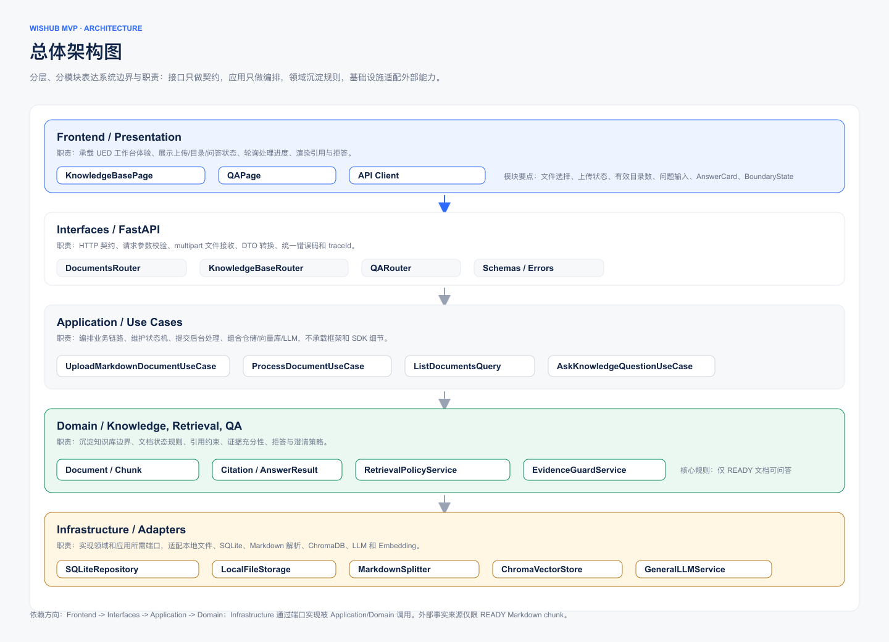
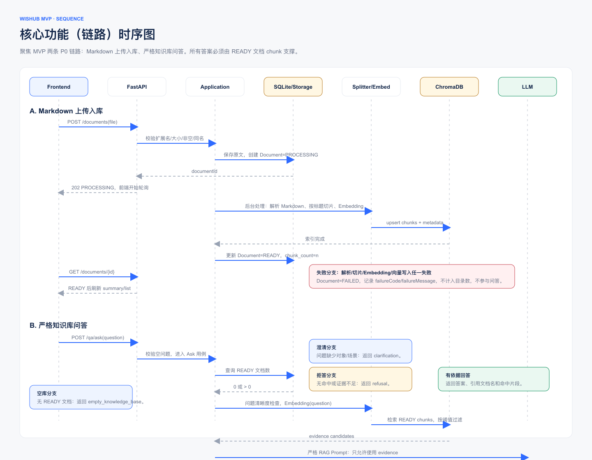

# wishub MVP 技术方案

> 版本：MVP  
> 作者角色：Tech Lead  
> 依据：PM PRD `docs/requirements/mishub_mvp/prd/00-formal-prd.md`、UED 稿 `docs/requirements/mishub_mvp/design/wishub-mvp-ui.pen`、现有架构文档 `docs/architecture-ddd-rag.md`  
> 核心原则：知识库是唯一事实来源；有依据才回答，无依据明确拒答。

## 1. 目标与范围

### 1.1 交付目标

本方案支撑 wishub MVP 的最小闭环：

1. 用户上传单个 Markdown 文件。
2. 系统完成校验、解析、切片、向量化和索引入库。
3. 页面展示有效文档目录数和有效文档列表。
4. 用户基于当前有效知识库提问。
5. 系统仅基于检索到的知识库证据回答，并返回引用；证据不足时拒答，问题不清晰时澄清。

### 1.2 本期边界

本期只实现单租户、单知识库、单文件 Markdown 上传、基础目录统计和单轮问答。不实现登录、多租户、权限、文档删除/替换/编辑、批量导入、会话管理、联网搜索、外部知识补答和复杂运营报表。

### 1.3 技术约束

- 后端沿用当前 Python + DDD/RAG 方向，以 FastAPI 暴露 API。
- 向量库优先复用现有 ChromaDB 适配方向，持久化路径默认 `database/vector_db`。
- MVP 使用本地 SQLite 保存文档元数据和处理状态，避免把 Chroma 内部 SQLite 当业务数据库使用。
- 文档处理使用 FastAPI `BackgroundTasks` 承接异步体验；不引入独立 MQ。后续可平滑替换为 Celery/RQ。
- LLM 和 Embedding 通过 Domain 抽象隔离，禁止问答流程调用外部搜索或知识库外事实源。

## 2. 当前代码现状

当前仓库已经具备部分领域和基础设施雏形：

- `backend/domain/domainsvc/data_spliter.py`：切片服务抽象。
- `backend/domain/domainsvc/embedding.py`：向量存储保存抽象。
- `backend/domain/domainsvc/llm_service.py`：LLM/Embedding 抽象。
- `backend/infra/vectordb/chromadb_embedding_service.py`：ChromaDB `save` 实现。
- `backend/infra/llm/llm_service_openai.py`：OpenAI-compatible LLM 和本地 SentenceTransformer embedding 实现。

主要缺口：

- 尚无 FastAPI 应用、Router、DTO 和统一错误响应。
- 尚无文档元数据仓储、状态机和目录计数。
- `DataSpliter` 及 `langchain_spliter.py` 尚未形成可用 Markdown 切片实现。
- `EmbeddingService` 只有 `save`，缺少 `query/delete` 等检索所需能力。
- `LLMService` 抽象和实现签名不一致，需要在落地时统一。
- `frontend/` 为空，需要按 UED 稿实现知识库页和知识问答页。

## 3. 总体架构

总体架构按 Frontend、Interfaces、Application、Domain、Infrastructure 分层。依赖方向保持 `Interfaces -> Application -> Domain <- Infrastructure`；Application 层只编排业务流程，不直接依赖 FastAPI、Chroma、OpenAI SDK 等实现细节。



Pencil 源文件：`docs/requirements/mishub_mvp/tech_solution/diagrams/wishub-mvp-tech-diagrams.pen`，画布 `Tech/Overall Architecture`。

## 4. 核心功能（链路）时序图

核心链路覆盖 Markdown 上传入库和严格知识库问答。上传链路以 `PROCESSING -> READY/FAILED` 状态机保证目录数口径一致；问答链路只检索 READY 文档 chunk，并在生成后校验 citation 必须来自本次检索证据。



Pencil 源文件：`docs/requirements/mishub_mvp/tech_solution/diagrams/wishub-mvp-tech-diagrams.pen`，画布 `Tech/Core Sequence`。

## 5. 模块设计

### 5.1 Interfaces 层

建议目录：

```text
backend/interface/api/v1/
  documents.py
  knowledge_base.py
  qa.py
backend/interface/schemas/
  documents.py
  knowledge_base.py
  qa.py
  errors.py
```

职责：

- 请求参数校验和 multipart 文件接收。
- 将应用层结果转换为前端 DTO。
- 统一错误码、HTTP 状态码和 `traceId`。
- 不在 Router 中写解析、切片、Embedding、Prompt 逻辑。

### 5.2 Application 层

建议目录：

```text
backend/application/commandsvc/
  upload_markdown_document.py
  process_document.py
backend/application/querysvc/
  list_documents.py
  ask_knowledge_question.py
backend/application/dto/
```

核心用例：

- `UploadMarkdownDocumentUseCase`：校验文件、保存原始文件、创建 `PROCESSING` 文档记录、提交后台处理任务。
- `ProcessDocumentUseCase`：解析 Markdown、切片、向量化、写入 Chroma、更新文档状态。
- `ListDocumentsQuery`：返回有效文档数量和列表。
- `AskKnowledgeQuestionUseCase`：检查空库、检索证据、生成答案、做引用校验和边界判断。

### 5.3 Domain 层

建议目录：

```text
backend/domain/knowledge/
  entities.py
  value_objects.py
  repositories.py
  services.py
backend/domain/retrieval/
  services.py
  policies.py
backend/domain/qa/
  entities.py
  services.py
```

核心领域对象：

- `Document`：知识文档聚合根。
- `DocumentChunk`：文档切片，作为检索与引用最小单元。
- `Citation`：引用依据，必须来自已检索 chunk。
- `AnswerResult`：问答结果，包含 `answer/refusal/clarification/empty_knowledge_base/error` 类型。

领域规则：

- 只有 `READY` 文档计入有效目录数并参与问答。
- `FAILED` 和 `PROCESSING` 文档不计数、不参与检索。
- 引用只能指向真实存在的 `DocumentChunk`，不得由 LLM 自行生成。
- 证据不足时返回拒答，不允许使用模型训练知识补全。

### 5.4 Infrastructure 层

建议目录：

```text
backend/infra/persistence/
  sqlite_connection.py
  document_repository.py
backend/infra/storage/
  local_file_storage.py
backend/infra/vectordb/
  chromadb_vector_store.py
backend/infra/spliter/
  markdown_spliter.py
backend/infra/llm/
  llm_service_openai.py
```

落地注意：

- 将现有 `ChromaDBEmbeddingService` 扩展为 `ChromaVectorStore`，补齐 `query` 能力。
- 修正 `langchain_spliter.py`，产出带 `headingPath/chunkIndex/text` 的结构化 chunk。
- 统一 `LLMService.complete` 抽象和 `GeneralLLMService.complete` 实现签名。
- 避免每次 embedding 都重新加载 `SentenceTransformer`，模型实例应在服务初始化时加载并复用。

## 6. 数据模型

### 6.1 SQLite 业务表

`documents`

| 字段 | 类型 | 说明 |
|---|---|---|
| id | text primary key | UUID |
| filename | text | 展示文件名，保留原始扩展名 |
| storage_path | text | 原始 Markdown 本地存储路径 |
| content_sha256 | text | 内容哈希，用于幂等和排查 |
| size_bytes | integer | 文件大小 |
| mime_type | text | 上传时的 MIME 类型 |
| status | text | `PROCESSING/READY/FAILED` |
| failure_code | text nullable | 失败错误码 |
| failure_message | text nullable | 可展示失败原因 |
| chunk_count | integer | 成功入库 chunk 数 |
| created_at | datetime | 创建时间 |
| updated_at | datetime | 更新时间 |
| processed_at | datetime nullable | 处理完成时间 |

索引：

- `idx_documents_status_updated_at(status, updated_at)`
- `uniq_documents_filename(filename)`：MVP 默认同名文档拒绝上传，避免无替换能力下目录歧义。
- `idx_documents_sha256(content_sha256)`：支持相同内容幂等判断。

`document_chunks`

| 字段 | 类型 | 说明 |
|---|---|---|
| id | text primary key | `{document_id}:{chunk_index}` |
| document_id | text | 关联文档 |
| chunk_index | integer | 文档内顺序 |
| heading_path | text nullable | Markdown 标题路径 |
| text | text | chunk 原文 |
| token_estimate | integer | 估算 token 数 |
| created_at | datetime | 创建时间 |

说明：`document_chunks` 保存引用和调试需要的文本；Chroma 保存向量、文本和同样的 metadata。两边使用同一个 chunk id 对齐。

### 6.2 Chroma Collection

Collection 名称：`wishub_mvp_documents`

向量 id：`{document_id}:{chunk_index}`

metadata：

```json
{
  "documentId": "uuid",
  "documentName": "产品使用指南.md",
  "chunkIndex": 3,
  "headingPath": "使用指南 > 上传文档",
  "status": "READY",
  "contentSha256": "..."
}
```

query 时只检索 `status = READY` 的 chunk。处理失败时不写入 chunk；若写入过程中失败，需要删除本次 `documentId` 下已写入的向量或将文档标记为 `FAILED` 并在 query 过滤中排除。

## 7. API 设计

统一响应错误结构：

```json
{
  "error": {
    "code": "ONLY_MARKDOWN_SUPPORTED",
    "message": "仅支持 Markdown 文件（.md）",
    "traceId": "..."
  }
}
```

### 7.1 获取知识库摘要

`GET /api/v1/knowledge-base/summary`

响应：

```json
{
  "readyDocumentCount": 12,
  "status": "READY",
  "boundaryText": "回答只来自已处理成功的 Markdown 文档，不调用外部搜索或常识补全。"
}
```

`status` 枚举：

- `EMPTY`：有效文档数为 0。
- `READY`：有效文档数大于 0。
- `PROCESSING`：存在处理中任务，但有效文档数可能为 0 或大于 0。
- `ERROR`：摘要加载失败时由接口错误表达，前端展示加载失败状态。

### 7.2 获取文档列表

`GET /api/v1/documents?status=READY&limit=50&offset=0`

响应：

```json
{
  "readyDocumentCount": 12,
  "documents": [
    {
      "id": "uuid",
      "filename": "产品使用指南.md",
      "sizeBytes": 253952,
      "status": "READY",
      "chunkCount": 18,
      "processedAt": "2026-07-17T09:42:00+08:00"
    }
  ]
}
```

默认只返回 `READY` 文档，用于“有效文档目录”。如后续需要展示失败/处理中历史，可增加 `status=ALL`，但不能计入有效目录数。

### 7.3 上传 Markdown 文档

`POST /api/v1/documents`

请求：`multipart/form-data`

- `file`：单个 Markdown 文件。

成功响应：`202 Accepted`

```json
{
  "documentId": "uuid",
  "filename": "产品使用指南.md",
  "status": "PROCESSING",
  "message": "文件已上传，正在解析和建立检索索引。"
}
```

校验错误：

| HTTP | code | 说明 |
|---:|---|---|
| 400 | `ONLY_MARKDOWN_SUPPORTED` | 非 `.md` 或解析前置校验不通过 |
| 400 | `EMPTY_MARKDOWN_FILE` | 空文件 |
| 409 | `DUPLICATE_DOCUMENT_NAME` | MVP 默认拒绝同名文档 |
| 413 | `FILE_TOO_LARGE` | 超过配置大小 |
| 500 | `DOCUMENT_UPLOAD_FAILED` | 存储或任务提交失败 |

### 7.4 查询文档处理状态

`GET /api/v1/documents/{documentId}`

响应：

```json
{
  "id": "uuid",
  "filename": "产品使用指南.md",
  "status": "READY",
  "failureCode": null,
  "failureMessage": null,
  "chunkCount": 18,
  "createdAt": "2026-07-17T09:41:50+08:00",
  "processedAt": "2026-07-17T09:42:00+08:00"
}
```

前端上传后轮询该接口。轮询间隔建议 1s，最长 60s；超时后展示“处理中，可稍后刷新”或错误重试入口。

### 7.5 知识问答

`POST /api/v1/qa/ask`

请求：

```json
{
  "question": "如何上传一个 Markdown 文档并让它参与问答？"
}
```

有依据回答：

```json
{
  "type": "answer",
  "question": "如何上传一个 Markdown 文档并让它参与问答？",
  "answer": "先进入知识库页面，选择一个 Markdown 文件上传；文件解析和索引完成后，文档会进入有效目录并参与问答。",
  "citations": [
    {
      "documentId": "uuid",
      "documentName": "产品使用指南.md",
      "chunkId": "uuid:3",
      "headingPath": "上传与入库",
      "excerpt": "文档处理完成后，才会进入有效目录并参与知识问答。"
    }
  ],
  "checks": {
    "foundEvidence": true,
    "externalKnowledgeUsed": false,
    "citationDocumentCount": 1
  }
}
```

拒答：

```json
{
  "type": "refusal",
  "message": "当前知识库暂无相关依据",
  "detail": "这个问题无法从当前知识库中的 Markdown 文档确认。你可以换一种问法，或补充更具体的关键词。",
  "citations": []
}
```

澄清：

```json
{
  "type": "clarification",
  "message": "请补充问题信息",
  "detail": "当前问题缺少具体对象或使用场景。请补充产品、功能或条件后再提问。"
}
```

空知识库：

```json
{
  "type": "empty_knowledge_base",
  "message": "当前没有可用于问答的文档",
  "detail": "先上传并处理完成一个 Markdown 文档，再开始提问。"
}
```

问答异常使用 5xx 错误响应。前端展示“本次问答未完成，检索服务暂时不可用，未生成未经验证的回答。”

## 8. 文档入库流程

```text
用户选择文件
  -> 前端校验扩展名
  -> POST /documents
  -> 后端校验扩展名、大小、非空、同名
  -> 保存原始 Markdown
  -> 创建 Document(status=PROCESSING)
  -> 后台处理
      -> 读取 Markdown
      -> 解析纯文本和标题层级
      -> Markdown-aware chunk
      -> 批量 embedding
      -> 写入 Chroma
      -> 写入 document_chunks
      -> Document(status=READY, chunk_count=n)
  -> 前端轮询 Document 状态
  -> READY 后刷新摘要和有效文档列表
```

处理失败路径：

- 解析为空、切片为空、embedding 失败、Chroma 写入失败都将文档标记为 `FAILED`。
- `FAILED` 文档不计入 `readyDocumentCount`，不出现在默认有效文档列表，不参与问答。
- 失败原因通过 `failureCode/failureMessage` 返回给上传组件。

切片策略：

- 使用 Markdown 标题作为结构边界，保留 `headingPath`。
- 默认 chunk size：800-1000 中文字符或等价 token 估算。
- 默认 overlap：100-150 字符，降低跨段落答案丢失风险。
- 代码块、表格优先保持完整；超长块再二次切分。
- 空白、重复分隔符和不可见字符在入库前归一化。

## 9. 问答流程与证据边界

```text
POST /qa/ask
  -> 校验问题非空
  -> 查询 READY 文档数
  -> 空库则返回 empty_knowledge_base
  -> 问题清晰度检查
  -> embedding(question)
  -> Chroma topK 检索 READY chunks
  -> 相关性阈值过滤
  -> 无有效证据则 refusal
  -> 构造严格 RAG Prompt
  -> LLM 仅基于 evidence 生成结构化结果
  -> 校验 citations 必须属于 retrieved chunks
  -> 返回 answer/refusal/clarification
```

### 9.1 检索策略

MVP 使用向量召回：

- `topK = 5`，可通过配置调整。
- `minSimilarityScore` 初始建议 0.35-0.45，需通过验收样例校准。
- 返回证据按相关性排序，最多传入 5 个 chunk 给 LLM。
- 只召回 `READY` 文档 chunk。

后续可演进为关键词 + 向量混合召回、rerank、按标题加权和离线评测阈值调优。

### 9.2 证据充分性判断

采用两层保护：

1. 检索前置保护：无命中或命中低于阈值，直接拒答。
2. 生成后置保护：LLM 必须输出结构化结果，引用 id 必须来自本次检索结果；否则降级为拒答或系统错误。

Prompt 约束要点：

- 只能使用提供的 evidence。
- 不得使用常识、训练知识、联网内容或猜测。
- 证据不足时输出 `refusal`。
- 问题缺少对象、场景或条件时输出 `clarification`。
- 引用必须使用 evidence 中给定的 `chunkId`。

### 9.3 结果类型

| type | 场景 | 前端状态 |
|---|---|---|
| `answer` | 有足够证据 | AnswerCard + Citation |
| `refusal` | 知识库无依据或证据不足 | State/QA/Refusal |
| `clarification` | 问题缺少关键条件 | State/QA/Clarify |
| `empty_knowledge_base` | 无 READY 文档 | State/QA/Empty |
| error response | 检索/生成系统异常 | State/QA/Error |

## 10. UED 状态对接

### 10.1 知识库页

UED 页面：

- `Page/KnowledgeBase`
- `Page/KnowledgeBase/Empty`
- `Page/KnowledgeBase/UploadStates`
- `Page/Responsive/KnowledgeBase`

数据来源：

- 目录数：`GET /api/v1/knowledge-base/summary.readyDocumentCount`
- 有效文档列表：`GET /api/v1/documents?status=READY`
- 上传任务：`POST /api/v1/documents` + `GET /api/v1/documents/{documentId}`

状态映射：

| UED 状态 | 触发条件 | 技术行为 |
|---|---|---|
| 默认 | 未选择文件 | 上传组件待选择 |
| 已选择 | 本地选择 `.md` 文件 | 展示文件名/大小，允许提交 |
| 非 Markdown | 本地扩展名或后端校验失败 | 展示“仅支持 Markdown 文件（.md）” |
| 上传中 | multipart 请求传输中 | 禁用重复提交，显示进度 |
| 处理中 | POST 已返回 `PROCESSING` | 轮询文档状态 |
| 成功 | 文档状态 `READY` | 展示成功，刷新摘要和列表 |
| 失败 | 文档状态 `FAILED` 或 POST 错误 | 展示失败原因，允许重新选择 |
| 空态 | `readyDocumentCount = 0` | 展示空知识库引导 |
| 加载失败 | summary/list 请求失败 | 展示重试，不展示过期数值作为当前结果 |

### 10.2 知识问答页

UED 页面：

- `Page/QA`
- `Page/QA/Answer`
- `Page/QA/BoundaryStates`

状态映射：

| UED 状态 | API 结果 | 技术行为 |
|---|---|---|
| 初始态 | 未提交问题 | 展示输入框、示例问题和边界说明 |
| 提交中 | `/qa/ask` pending | 禁用重复提交 |
| 有依据回答 | `type=answer` | 展示 AnswerCard、Citation、检查项 |
| 无依据拒答 | `type=refusal` | 展示“当前知识库暂无相关依据” |
| 需澄清 | `type=clarification` | 展示补充信息提示 |
| 空知识库 | `type=empty_knowledge_base` | 引导去上传 Markdown |
| 系统错误 | 5xx 或网络错误 | 展示重试；不得展示兜底答案 |

响应式页面复用相同 API 和状态机，只调整布局，不改变业务语义。

## 11. 异常处理与错误码

| code | HTTP | 用户可见文案 | 处理 |
|---|---:|---|---|
| `ONLY_MARKDOWN_SUPPORTED` | 400 | 仅支持 Markdown 文件（.md） | 阻断上传 |
| `EMPTY_MARKDOWN_FILE` | 400 | Markdown 内容为空 | 阻断上传 |
| `FILE_TOO_LARGE` | 413 | 文件超出大小限制 | 阻断上传 |
| `DUPLICATE_DOCUMENT_NAME` | 409 | 已存在同名文档 | 阻断上传 |
| `MARKDOWN_PARSE_FAILED` | 200 status=`FAILED` | 无法解析该 Markdown 内容，请检查文件后重试 | 不计数 |
| `EMBEDDING_FAILED` | 200 status=`FAILED` | 建立检索索引失败，请重试 | 不计数 |
| `VECTOR_STORE_FAILED` | 200 status=`FAILED` | 知识入库失败，请重试 | 不计数 |
| `KNOWLEDGE_BASE_EMPTY` | 200 type=`empty_knowledge_base` | 当前没有可用于问答的文档 | 引导上传 |
| `QA_RETRIEVAL_FAILED` | 500 | 检索服务暂时不可用，未生成未经验证的回答 | 可重试 |
| `QA_GENERATION_FAILED` | 500 | 本次问答未完成 | 可重试 |

后台任务失败必须落库到 `documents.failure_code/failure_message`，避免前端轮询永久卡在 `PROCESSING`。

## 12. 非功能设计

### 12.1 配置

建议配置项：

```text
WISHUB_SQLITE_PATH=database/wishub.sqlite3
WISHUB_UPLOAD_DIR=database/uploads
WISHUB_CHROMA_PATH=database/vector_db
WISHUB_CHROMA_COLLECTION=wishub_mvp_documents
WISHUB_MAX_MARKDOWN_BYTES=5242880
WISHUB_INGESTION_TIMEOUT_SECONDS=60
WISHUB_QA_TIMEOUT_SECONDS=60
WISHUB_RETRIEVAL_TOP_K=5
WISHUB_RETRIEVAL_MIN_SCORE=0.4
LLM_MODEL_ID=...
LLM_API_KEY=...
LLM_BASE_URL=...
EMBEDDING_MODEL=BAAI/bge-large-zh-v1.5
```

文件大小、总文档数和上传频率仍属于 PM 待确认项。上述值作为工程默认值，需在验收前确认。

### 12.2 性能

- 单文件上传大小默认 5 MB。
- 单文档 chunk 上限默认 500，超过则处理失败并提示文件过大或结构过长。
- embedding 批量提交，避免逐 chunk 串行网络调用。
- QA 请求目标 P95 小于 10s；超时返回错误，不输出兜底答案。

### 12.3 安全

- 文件名只用于展示，存储路径使用 UUID，防止路径穿越。
- 只接受 `.md`，并通过 UTF-8 解码和内容非空校验。
- 日志不记录完整文档内容、完整问题答案或密钥。
- MVP 不做登录鉴权；若部署到共享环境，需要在网关层限制访问。

### 12.4 可观测

结构化日志字段：

- `trace_id`
- `document_id`
- `filename`
- `status`
- `chunk_count`
- `retrieval_top_k`
- `retrieval_hit_count`
- `answer_type`
- `latency_ms`
- `failure_code`

关键指标：

- 上传成功率、处理失败率。
- 有效文档数。
- QA 有依据回答率、拒答率、澄清率、错误率。
- 检索平均命中数和 P95 延迟。

## 13. 测试方案

### 13.1 单元测试

- Markdown 文件校验：扩展名、空文件、大小限制。
- Markdown 切片：标题路径、代码块、表格、超长段落。
- 文档状态机：`PROCESSING -> READY/FAILED`，失败不计数。
- Repository：同名冲突、ready count、列表排序。
- Citation 校验：LLM 返回未检索 chunk id 时拒绝。
- QA 类型映射：answer/refusal/clarification/empty/error。

### 13.2 集成测试

使用测试 SQLite、临时上传目录、测试 Chroma collection，并 mock LLM/Embedding：

- 上传合法 `.md` 后最终 `READY`，目录数 +1。
- 上传非 Markdown 返回 `ONLY_MARKDOWN_SUPPORTED`。
- 上传空 Markdown 返回 `EMPTY_MARKDOWN_FILE`。
- 后台处理失败后状态 `FAILED`，目录数不变。
- 空知识库提问返回 `empty_knowledge_base`。
- 命中 fixture 文档的问题返回 `answer` 和真实 citation。
- 知识库外问题返回 `refusal`。
- 模糊问题返回 `clarification`。
- 检索异常返回错误状态，且无 answer 字段。

### 13.3 前端验收测试

- 知识库空态、加载态、失败重试。
- 上传组件默认、已选择、上传中、处理中、成功、失败、非 Markdown。
- 有效目录数与列表条数一致。
- QA 初始、提交中、有依据回答、拒答、澄清、空库、错误重试。
- 桌面与移动布局均不改变状态语义。

## 14. 实施任务拆解

### 14.1 后端

1. 补齐依赖和 FastAPI 应用入口：`fastapi`、`uvicorn`、`python-multipart`、`chromadb`、`sqlalchemy` 或标准库 `sqlite3` 封装。
2. 建立配置、日志、错误响应和依赖注入。
3. 实现 SQLite 文档仓储和本地文件存储。
4. 实现 Markdown splitter，产出结构化 chunk。
5. 扩展 Chroma vector store：`save/query/delete_by_document_id`。
6. 修正 LLMService 抽象和实现签名，复用 embedding 模型实例。
7. 实现上传、处理、列表、摘要 API。
8. 实现 QA 检索、Prompt、证据校验和结果类型。
9. 补齐后端单元测试和集成测试。

### 14.2 前端

1. 初始化前端工程，建立路由：知识库页、知识问答页。
2. 实现 UED 设计系统 token、侧边栏、顶部栏、StatCard、UploadDropzone、DocumentRow、QuestionComposer、AnswerCard、BoundaryState。
3. 接入知识库摘要和文档列表 API。
4. 接入上传 API 和状态轮询。
5. 接入 QA API 和全部边界状态。
6. 完成响应式知识库布局。
7. 补齐交互测试和基础 E2E 验收用例。

### 14.3 联调与验收

1. 准备 Markdown fixture：有依据、无依据、模糊、冲突、空文档。
2. 按 PRD AC-01 到 AC-14 逐项验收。
3. 校准检索阈值和拒答阈值。
4. 检查日志中不泄露密钥和完整文档内容。

## 15. 风险与应对

| 风险 | 影响 | 应对 |
|---|---|---|
| Markdown 格式复杂导致切片质量不稳定 | 检索召回不足 | 保留标题路径，表格/代码块特殊处理，建立 fixture 回归 |
| 检索阈值不准 | 误拒答或误回答 | 用验收样例校准 `minSimilarityScore`，记录命中分数 |
| LLM 越过证据扩写 | 幻觉回答 | 严格 Prompt + citation 后校验 + 证据不足拒答 |
| 后台任务进程中断 | 文档长时间 PROCESSING | 增加处理超时和启动时卡死任务恢复为 FAILED |
| 同名文档策略未确认 | 目录计数歧义 | MVP 默认拒绝同名，待 PM 确认后调整 |
| 本地模型首次加载慢 | 上传或问答延迟高 | 服务启动预热 embedding 模型，记录加载耗时 |

## 16. 待确认项

1. 单文件大小、总文档数、上传频率限制。
2. 同名文档最终策略：拒绝、忽略、覆盖还是生成重复条目。
3. 是否允许无 `.md` 后缀但内容合法的 Markdown。
4. 引用最小形态是否必须包含片段，还是仅文档名可验收。
5. 检索相关性阈值和拒答阈值的验收样例。
6. 处理中和失败文档是否需要在目录列表之外保留历史记录。
7. 共享环境部署时是否需要基础访问保护。

